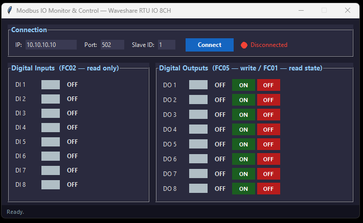

# Modbus IO Monitor & Control

---

## EN — English

Desktop application for monitoring and controlling the **Waveshare Modbus RTU IO 8CH** module via Modbus TCP/IP.



### Hardware

| Component | Details |
|-----------|---------|
| Module | Waveshare Modbus RTU IO 8CH (8x DI, 8x DO) |
| Converter | USR-DR134 (RS485 → Ethernet) |
| Default IP | `10.10.10.10` |
| Default Port | `502` |
| Default Slave ID | `1` |

### Requirements

- Python 3.8+
- pymodbus >= 3.6.0
- tkinter (included in standard Python on Windows)

### Installation

```bash
git clone <repo-url>
cd Waweshare

python -m venv venv
venv\Scripts\activate

pip install -r requirements.txt
```

### Usage

```bash
# Run the application
python modbus_monitor.py

# Test connection only
python test_connection.py
```

### Modbus Protocol

| Function | Code | Description |
|----------|------|-------------|
| Read DI | FC02 `read_discrete_inputs` | Address 0, count 8 |
| Read DO state | FC01 `read_coils` | Address 0, count 8 |
| Write DO | FC05 `write_coil` | Single coil |

### UI Overview

- **Connection bar** — IP, Port, Slave ID + Connect/Disconnect button + status indicator
- **Digital Inputs panel** — 8 read-only channels (green = ON, grey = OFF)
- **Digital Outputs panel** — 8 channels with ON/OFF buttons
- **Status bar** — last action or error message

### Build standalone EXE (Windows)

```bash
pip install pyinstaller
pyinstaller ModbusMonitor.spec
```

Output: `dist\ModbusMonitor.exe`

### Hardware reference

[Waveshare Modbus RTU IO 8CH Wiki](https://www.waveshare.com/wiki/Modbus_RTU_IO_8CH)

---

## SK — Slovensky

Desktopová aplikácia na monitorovanie a ovládanie modulu **Waveshare Modbus RTU IO 8CH** cez Modbus TCP/IP.

### Hardware

| Komponent | Detail |
|-----------|--------|
| Modul | Waveshare Modbus RTU IO 8CH (8x DI, 8x DO) |
| Konvertor | USR-DR134 (RS485 → Ethernet) |
| Predvolená IP | `10.10.10.10` |
| Predvolený port | `502` |
| Predvolené Slave ID | `1` |

### Požiadavky

- Python 3.8+
- pymodbus >= 3.6.0
- tkinter (súčasť štandardného Pythonu na Windows)

### Inštalácia

```bash
git clone <repo-url>
cd Waweshare

python -m venv venv
venv\Scripts\activate

pip install -r requirements.txt
```

### Spustenie

```bash
# Spustenie aplikácie
python modbus_monitor.py

# Test pripojenia
python test_connection.py
```

### Modbus protokol

| Funkcia | Kód | Popis |
|---------|-----|-------|
| Čítanie DI | FC02 `read_discrete_inputs` | Adresa 0, počet 8 |
| Čítanie stavu DO | FC01 `read_coils` | Adresa 0, počet 8 |
| Zápis DO | FC05 `write_coil` | Jeden výstup |

### Rozhranie

- **Lišta pripojenia** — IP, Port, Slave ID + tlačidlo Connect/Disconnect + indikátor stavu
- **Panel digitálnych vstupov** — 8 kanálov, len na čítanie (zelená = ZAP, sivá = VYP)
- **Panel digitálnych výstupov** — 8 kanálov s tlačidlami ON/OFF
- **Stavový riadok** — posledná akcia alebo chybová správa

### Kompilácia EXE (Windows)

```bash
pip install pyinstaller
pyinstaller ModbusMonitor.spec
```

Výstup: `dist\ModbusMonitor.exe`

### Dokumentácia hardvéru

[Waveshare Modbus RTU IO 8CH Wiki](https://www.waveshare.com/wiki/Modbus_RTU_IO_8CH)
